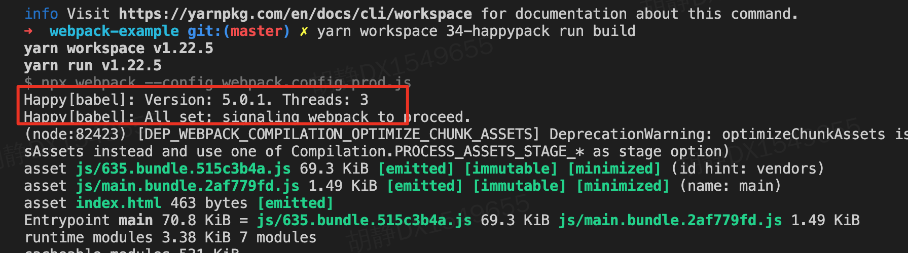

## 1. 什么是HappyPack?
默认情况下 `webpack` 打包项目是单线程的, 为了提升打包速度, 充分发挥多核 `CPU` 电脑的威力
我们可以通过 `HappyPack` 让 `webpack` 实现多线程打包
<div style="margin-bottom: 50px;"></div>


## 2. HappyPack使用
### 2.1 安装依赖
```js
npm install --save-dev happypack
```
<div style="margin-bottom: 30px;"></div>

### 2.2 配置
```js
{
  test: /\.js$/,
  exclude: /node_modules/,
  // 把对 .js 文件的处理转交给 id 为 babel 的 HappyPack 实例
  use: 'happypack/loader?id=babel'   // 不可用loader，而是用usejs文件
},
new HappyPack({
  id: 'babel', // 和上述 id 保持一致
  loaders:      
    [{
      test: /\.js$/,
      loader: 'babel-loader',
      exclude: /node_modules/
    }],
})
```
结果如图所示，大项目打包时才能在时间上有明显差异



<div style="margin-bottom: 50px;"></div>

[官网](https://www.npmjs.com/package/happypack)